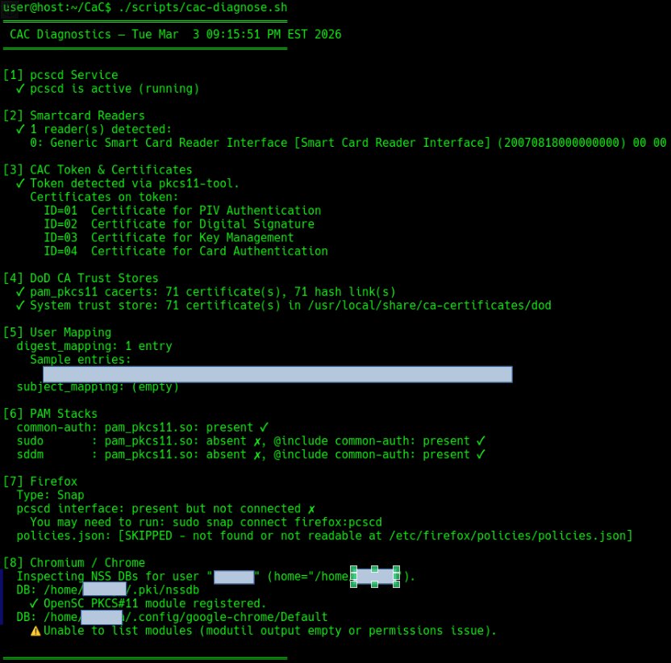

# Diagnostics

The **read-only** diagnostics script reports system health for CAC setup.

## How to run

```bash
./scripts/cac-diagnose.sh
# or with root (to read PAM and other protected paths):
sudo ./scripts/cac-diagnose.sh
```

Or via the menu: `./cac-setup` → option **8**, or `./cac-setup --diagnose`.



## What it checks

1. **pcscd** — Smartcard daemon status.
2. **Smartcard readers** — Connected readers.
3. **CAC token & certificates** — Token visibility and cert list.
4. **DoD CA trust stores** — pam_pkcs11 CA dir and system DoD certs.
5. **User mapping** — `digest_mapping` / `subject_mapping` summary.
6. **PAM stacks** — `common-auth`, `sudo`, `sddm` for `pam_pkcs11` and `@include common-auth`.
7. **Firefox** — Snap/APT detection, pcscd interface, `policies.json` for OpenSC.
8. **Chromium / Chrome** — NSS DB locations and OpenSC PKCS#11 registration.

Use this before and after changes when [Troubleshooting](Troubleshooting).
