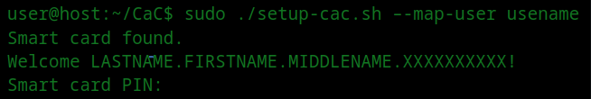

# PAM and User Mapping

PAM is configured so that:

- **sudo** and **SDDM** use `pam_pkcs11` via `/etc/pam.d/common-auth`.
- CAC authentication can be mapped to your Linux user via `/etc/pam_pkcs11/digest_mapping` (and optionally `subject_mapping`).

## Map CAC to your Linux user

With your CAC inserted:

```bash
sudo ./setup-cac.sh --map-user YOUR_USERNAME
```



Or directly:

```bash
sudo ./scripts/cac-map-user.sh YOUR_USERNAME
```

The script exports your auth cert from the card, computes its SHA1 fingerprint, and appends a line to `digest_mapping`. Re-running is idempotent (no duplicate entries).

If CAC auth does not match your username, check [Diagnostics](Diagnostics) section **[5] User Mapping** and [Troubleshooting](Troubleshooting).
